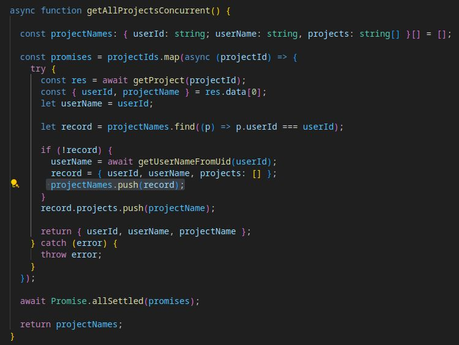
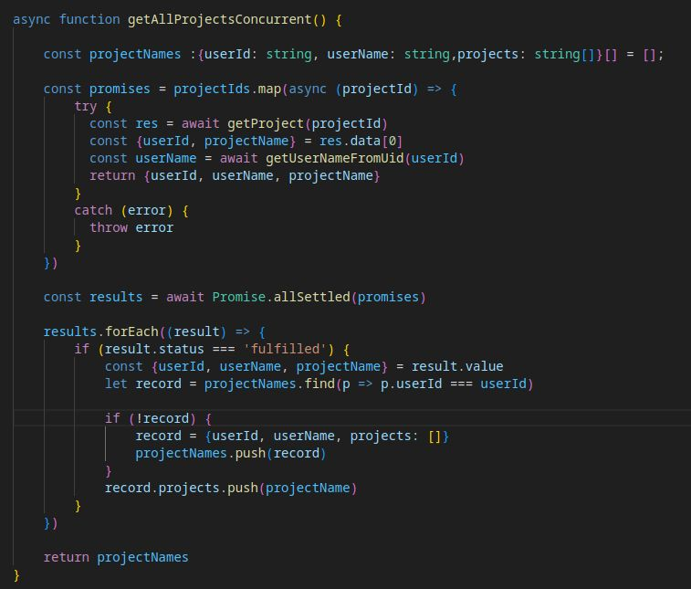

### 💡 Tip for Working with Concurrent Tasks
When managing concurrent tasks—especially when grouping data by a key —be careful to use Array or Map to store the intermediate or final results.
 
### 🔍 Why?
Check the first code snippet, where multiple tasks fetch project data and try to group projects by userId. When using an array to check for existing user records—as shown in the first code snippet—this approach can fail in a concurrent environment. Since each task may not be aware of changes made by others, it can result in duplicate entries for the same userId. Replacing the array with a Map doesn't fix the problem either.

### ✅ The Fix: 
Let all concurrent tasks complete first, then group the data afterward. This approach avoids race conditions and ensures that all projects for a given user are accurately grouped.

