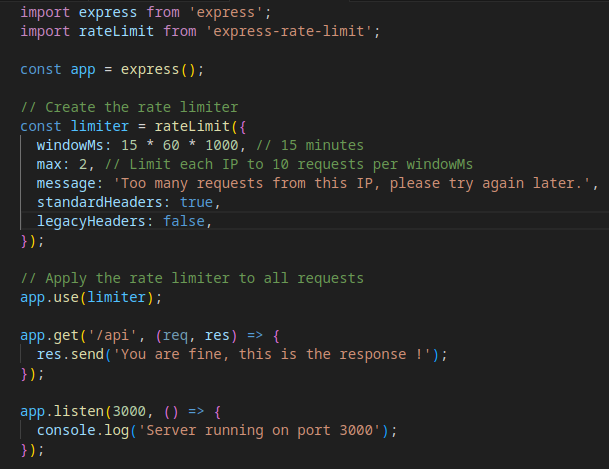
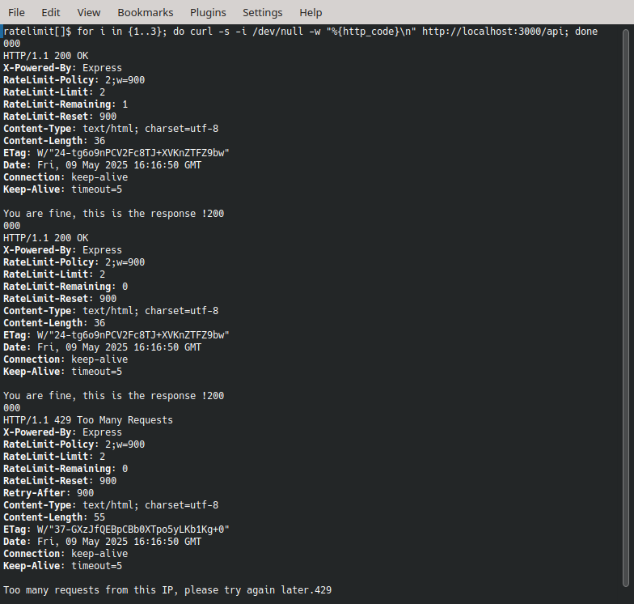

### 🚀 Protect Your Backend with Rate Limiting in Express! 🚀​​
Ever had your server crash because of too many requests? ​​Rate limiting​​ is a simple but powerful way to protect your backend from abuse, DDoS attacks, or accidental traffic spikes.

### 💡 Why Use Rate Limiting?​​
✅ ​​Prevents server overload​​ – Stops one user from spamming your API.
✅ ​​Protects against brute-force attacks​​ – Limits login attempts.
✅ ​​Fair usage​​ – Ensures all users get equal access.

🔒 With ​​Express​​, enabling rate limiting is super easy! Here’s how:

